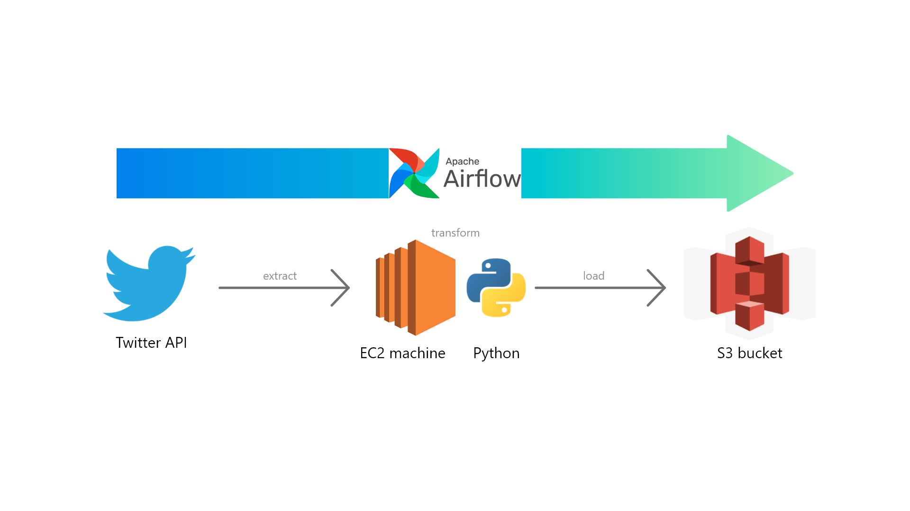

# Documentation

# Project Explanation:
 
1. Extract tweet (json format) using tweepy library.
 
 
2. Transform the data so that just get the data is needed, such as username, quote (content), quote by (writer of the quote), created time (tweet), total of like (tweet),
and total of retweet (tweet).
 
 
3. Transform the json data into dataframe.
 
 
4. Load data into AWS S3.
 
 
5. Build a Data Pipeline (DAG) using airflow from the step above.
 
 
6. Finally, run the DAG on the cloud AWS EC2.
